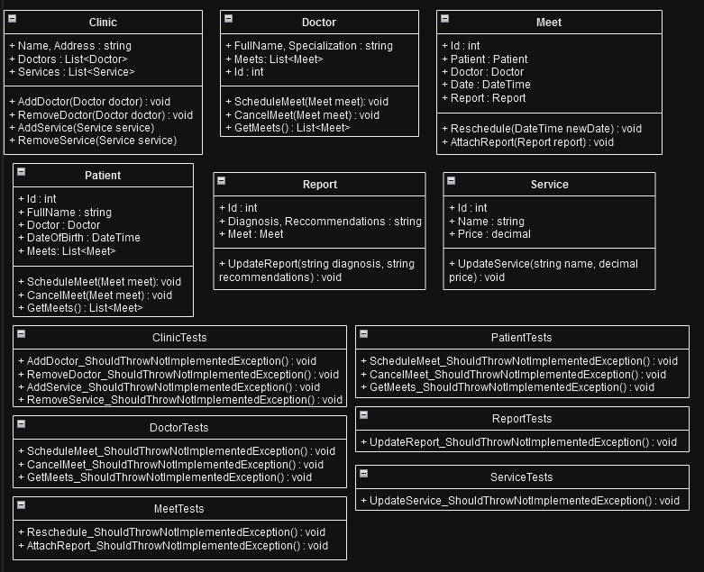

# OP
# Опис предметної області: Клініка

## Опис
Цей проєкт моделює систему для клініки, що містить основні сутності та їх взаємодії. Клініка надає медичні послуги пацієнтам, а лікарі проводять прийоми та ведуть медичні звіти. Пацієнти можуть записуватися на прийом до лікаря та отримувати рекомендації після консультацій.

## Основні сутності

### Клініка
- **Clinic**: Основний клас, що описує клініку, її назву, адресу, список лікарів та наданих послуг.
  
### Лікар
- **Doctor**: Клас, що описує лікаря, його ім'я, спеціалізацію та список прийомів, які він проводить з пацієнтами.

### Пацієнт
- **Patient**: Клас, що описує пацієнта, його ім'я, дату народження та список прийомів у лікарів.

### Прийом
- **Meet**: Клас, що описує прийом пацієнта до лікаря, дату та пов'язаний медичний звіт.

### Медичний звіт
- **MedicalReport**: Клас, що містить діагноз та рекомендації, пов'язані з прийомом пацієнта.

### Послуга
- **Service**: Клас, що описує медичні послуги клініки, які можуть бути надані пацієнту, включаючи ціну.

## Взаємозв'язки між класами
- **Clinic** має список лікарів та послуг.
- **Doctor** має список прийомів з пацієнтами.
- **Patient** може мати кілька прийомів у різних лікарів.
- **Meet** пов'язує лікаря та пацієнта, а також може мати медичний звіт.
- **MedicalReport** містить діагноз та рекомендації для пацієнта.

## Діаграма класів

Нижче представлена діаграма класів для моделювання клініки.

